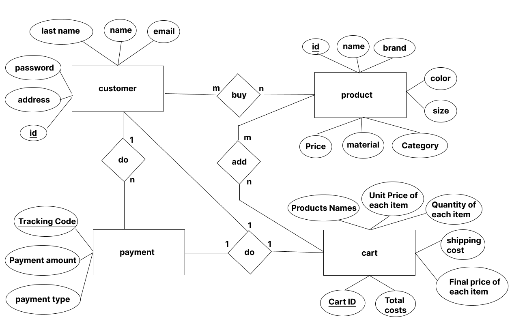

# fast-food-website
This website was the project of my special topics 1 course in the undergraduate course.
## Features and Capabilities:
- Responsive pages
- The possibility of signup and signin
- Food slider
## Languages:
- php
- javascript
- html/css
- mysql
## Frameworks and Libraries:
- jQuery(v3.6.0)
- bootstrap(v5.1.3)
- Owl Carousel 2 
## Why did I choose this topic for the project?
Websites provide the presence of any person, group, company and etc, in the Internet world. 
Having a website is like having a store that has no time and place restrictions and is available to the whole world. 
The online presence of a business in the web world outside of that type of business will have a great impact on its success. 
Nowadays, many of your customers visit your website before making a purchase. 
Having a quality online presence can increase your income. 
As for traditional and office businesses, the most important thing is to choose the right place for the sales office, and the busier the neighborhood is, the more likely it is to attract customers. 
The same thing is true for the internet business, if this business does not meet the necessary standards for creating a website or page, it will fail in its business. 
In today's world, the surest way to overcome these limitations is to offer the product through the website. 
After launching your website, you will have the possibility to attract customers from anywhere in the world without boundaries and to expand your circle of customers from any geographical boundaries. 
Considering the reasons mentioned and the importance of the website in the discussion of selling products, I planned to have experience in this field by implementing a store website.

## ER Diagram

## Home Page Preview

## Cart Page Preview

## Signup Page Preview

## Initial setup
1- Install XAMPP and start apache and mysql services. 
2- Upload the pizzo file into the folder at c:/xampp/htdocs (xampp software defualt installation location). 
3- Enter the http://localhost/phpmyadmin/ address in the browser. 
4- Click on the user accounts option and in the next step, click on the add user account option on the new page. 
5- On this page, you must enter the username and password according to the authentication.php file
. Then you have to select the option "Create database with same name" than the desired database
It should be created and matched with the username and the required access permission should be given to this user
Click on the go option at the bottom of the page. 
6- Click on the created database called pizoo and then click on the sql bar
And paste the contents of the user-table.sql file, in this section and click the "go" option to create tables in it. 
6- The website is ready for use and visit, now you can enter the website by entering the following address in the browser. 
Address: http://localhost/pizoo/index.html 
